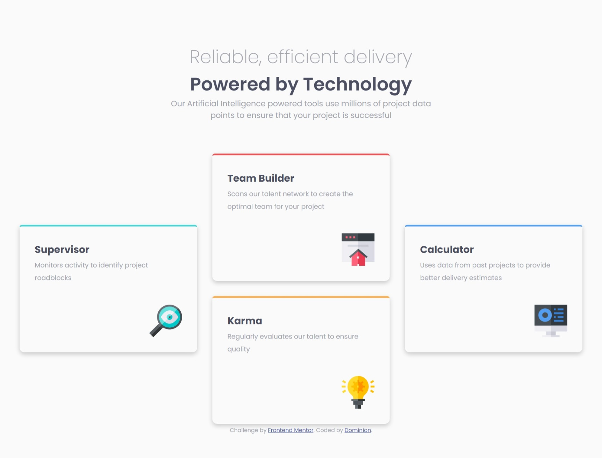
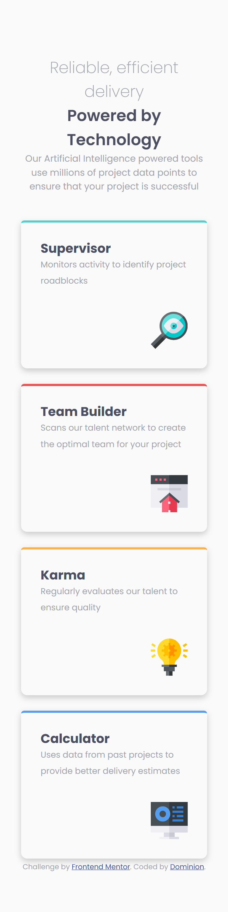

# Frontend Mentor - Four card feature section solution

This is a solution to the [Four card feature section challenge on Frontend Mentor](https://www.frontendmentor.io/challenges/four-card-feature-section-weK1eFYK). Frontend Mentor challenges help you improve your coding skills by building realistic projects. 

## Table of contents

- [Overview](#overview)
  - [The challenge](#the-challenge)
  - [Screenshot](#screenshot)
  - [Links](#links)
- [My process](#my-process)
  - [Built with](#built-with)
  - [What I learned](#what-i-learned)
  - [Continued development](#continued-development)
- [Author](#author)
- [Acknowledgments](#acknowledgments)

## Overview

### The challenge

Users should be able to:

- View the optimal layout for the site depending on their device's screen size

### Screenshot

### Links

- Solution URL: [Add solution URL here](https://your-solution-url.com)
- Live Site URL: [Add live site URL here](https://your-live-site-url.com)

## My process

### Built with

- Semantic HTML5 markup
- CSS custom properties
- Flexbox
- Mobile-first workflow

### What I learned

This challenge was a bit challenging, especially, what I am guessing would be the most challenging part for any newbie, changing the 4 sections from column layout to a 2-way layout. I'm curious to see how others went about tackling it. I'm sure there's a better way than the one I used but I am proud of the way I handled it. It made everything seem basic if you put it that way. A simple flexbox in a bigger flexbox.
Asides that, I had issues with responsiveness and scaling which I hope to improve upon.

### Continued development

Responsive Websites

## Author

- Frontend Mentor - [@why-not-phoenix](https://github.com/why-not-phoenix)
- Twitter - [@dominion_onoja](https://x.com/dominion_onoja?t=RAWgmHy3YlUySDiPDnZS2g&s=09)

## Acknowledgments

Myself, cos I didn't check other solutions before attempting this which is delightful especially with how it came out in the end.
